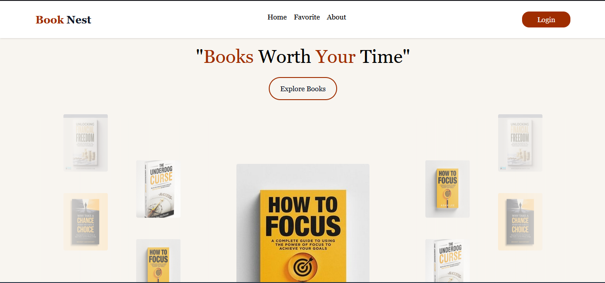
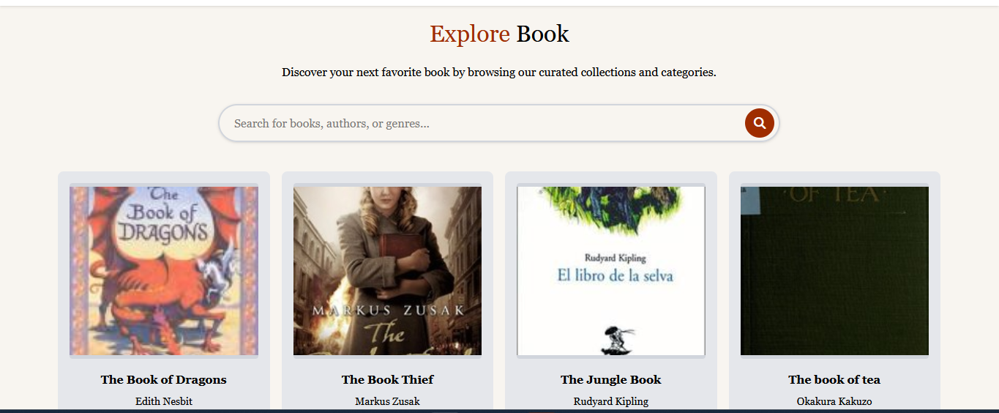
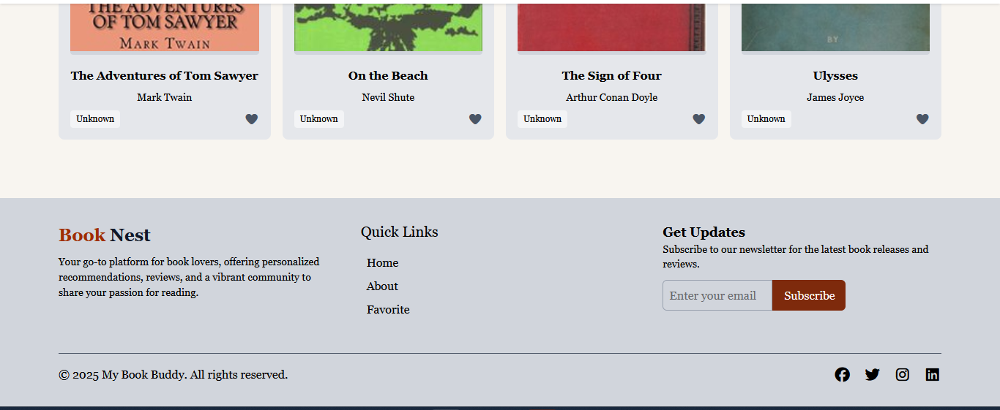
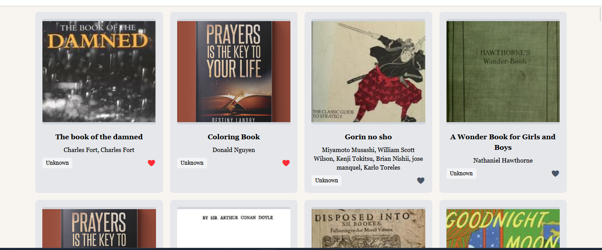
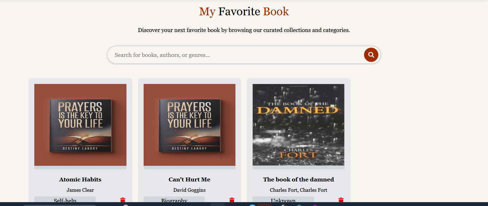
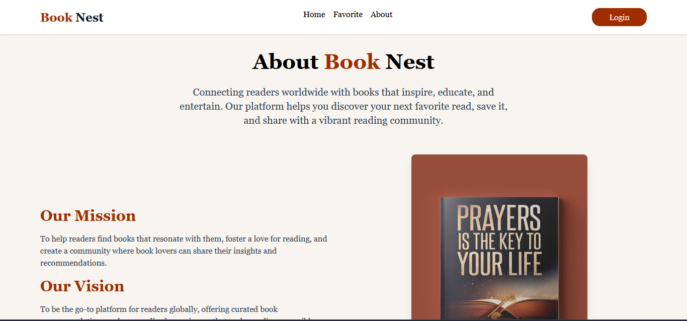
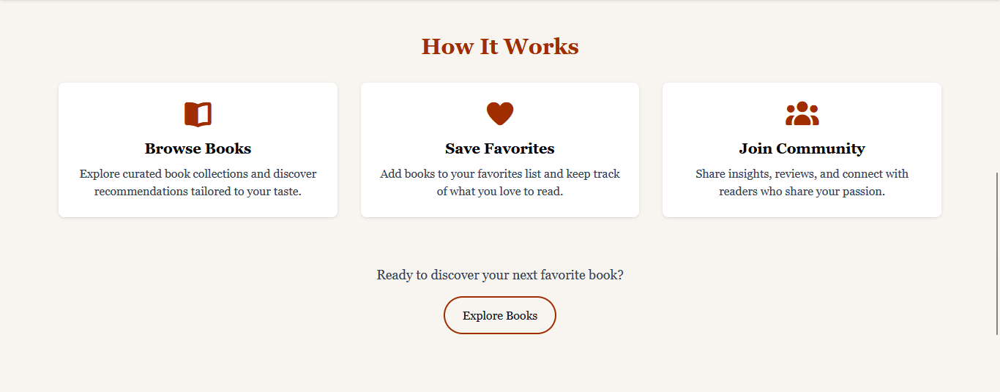

# Phase-One-Capstone-Project
Book Explorer is a student-focused website project designed to make discovering books easy and fun. It helps users browse, search, and learn about a wide variety of books.

## Project Screenshot

### Home page 




- adding to favorite
- - 

### the Fovorite page 



### the about page





## BookNest( My Book Buddy)

A simple **Book Explorer Web App** built with **HTML**, **Tailwind CSS**, and **JavaScript (Modules)**.  
The app fetches real book data from the **Open Library API**, displays it dynamically, and allows users to **favorite books** using `localStorage`.

---

##  Features

-  **Fetch real books** from [Open Library Search API](https://openlibrary.org/developers/api).
-  **Dynamic rendering** of book cards on the page.
-  **Favorite system** using local storage (persists even after page reload).
-  **Loading placeholders** with skeleton UI using Tailwind’s `animate-pulse`.
-  **Modular JavaScript structure**:
  - `fetchbooks.js` – Handles API fetching and data transformation.
  - `main.js` – Renders books and manages favorite logic.

---

##  Tech Stack

- **HTML5**  
- **Tailwind CSS** (via CDN)  
- **Vanilla JavaScript** (ES Modules)  
- **Open Library API**

---

## Project Structure

Phase-One-Capstone-Project
├── README.md                        # Project overview and documentation
├── LICENSE                          # (optional) License information
│
├── Lab1/                            # Lab 1: Basic HTML, CSS, and JS setup
│   ├── index.html                   # Home page
│   ├── about.html                   # About page
│   ├── main.js                      # Main JavaScript file
│   ├── style.css                    # (optional) Custom styling file
│   └── Images/                      # All images for Lab 1
│       ├── hero.png
│       ├── explore.png
│       ├── footer.png
│       ├── about1.png
│       ├── about2.png
│       └── addingtofav.png
│
├── Lab2/                            # Lab 2: Favorites functionality
│   ├── favorite.html                # Favorites page
│   ├── favorite.js                  # JS logic for managing favorites
│   └── style.css                    # (optional) Styles for favorite page
│
├── Lab3/                            # Lab 3: API integration
│   ├── fetchbooks.js                # JavaScript for fetching book data
│   ├── api-test.html                # (optional) Simple test page for API
│   └── style.css                    # (optional) Styling for fetched results
│
├── assets/                          # Shared assets (optional)
│   ├── icons/
│   ├── logos/
│   └── fonts/
│
└── docs/                            # Documentation (optional)
    └── presentation-slides/

        


## Installation and Setup

1. Clone the repository:
   ```bash

   git clone https://github.com/yourusername/Phase-One-Capstone-Project.git

   ```

2. Navigate to the project folder 

 ```bash
cd Phase-One-Capstone-Project/Lab1
 
 ```
3. Open index.html in your browser or use Live Server in VS Code.


###  **2. Usage Instructions**
Explain briefly how the website works or how users can interact with it:

## Usage

- On the **Home Page**, browse or search for books.  
- Click the **heart icon ❤️** to add a book to your favorites.  
- View your saved books on the **Favorites Page**.  
- Learn more about the project and team on the **About Page**.


